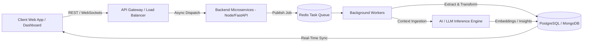

<div align="center">

  <!-- TOP GRAPHICAL BANNER -->
  

  <br/>

  <!-- ANIMATED TYPING EFFECT HEADER -->
  <a href="https://git.io/typing-svg">
    
  </a>

  <p align="center">
    <b>Crafting production-grade distributed systems, AI-powered applications, resilient backend architectures, and high-performance developer tools.</b>
  </p>

  <!-- QUICK SOCIAL & PROFESSIONAL CONTACT BADGES -->
  <p align="center">
    <a href="https://linkedin.com/in/sarthakdudhe" target="_blank">
      
    </a>
    <a href="https://github.com/sarthakdudhe" target="_blank">
      
    </a>
    <a href="mailto:sarthakdudhe.eng@gmail.com">
      
    </a>
    <a href="https://sarthakdudhe.dev" target="_blank">
      
    </a>
    <a href="#" target="_blank">
      
    </a>
  </p>

</div>

---

<!-- SECTION 1: ENGINEERING ANALYTICS DASHBOARD -->
<h2 align="center">📊 Engineering Activity & Telemetry Dashboard</h2>
<p align="center"><i>Real-time snapshot of code metrics, contribution consistency, language distribution, and GitHub activity.</i></p>

<div align="center">

| 📈 **Contribution Metrics** | ⚡ **Language Breakdown** |
| :---: | :---: |
|  |  |

| 🔥 **Streak Telemetry** | 🏆 **GitHub Achievements** |
| :---: | :---: |
|  |  |

</div>

<br/>

<!-- CONTRIBUTION SNAKE ANIMATION -->
<div align="center">
  <h3>🐍 Contribution Graph Animation</h3>
  
</div>

<div align="center">
  
</div>

---

<!-- SECTION 2: ENGINEERING STORY -->
<h2>📖 Engineering Mindset & Story</h2>

<blockquote>
"Great software is built at the intersection of architectural discipline, performance engineering, and relentless product empathy."
</blockquote>

<p>
I am a <b>Software Engineer</b> driven by a passion for designing scalable backend infrastructure, intelligent AI-driven workflows, and resilient full-stack applications. My focus centers on solving complex engineering challenges—whether optimizing database queries for sub-second responses, building real-time data pipelines, or integrating LLM reasoning capabilities directly into production SaaS platforms.
</p>

<p>
My engineering philosophy is simple:
</p>

- 🧱 **Architect for Reliability**: Prioritize modular, decoupled systems with clear separation of concerns, robust error handling, and end-to-end type safety.
- ⚡ **Optimize for Velocity & DX**: Write clean, self-documenting code with comprehensive automated tests and efficient deployment pipelines.
- 💡 **Product-Driven Execution**: Treat technical architecture as a means to deliver high-impact user experiences and measurable business value.

---

<!-- SECTION 3: ENGINEERING ECOSYSTEM -->
<h2>🛠️ Technical Ecosystem & Capabilities</h2>

<table width="100%">
  <tr>
    <td width="50%" valign="top">
      <h3>🚀 Backend & Systems</h3>
      <p>
        
        
        
        
        
        
      </p>
    </td>
    <td width="50%" valign="top">
      <h3>🎨 Frontend & Architecture</h3>
      <p>
        
        
        
        
        
      </p>
    </td>
  </tr>
  <tr>
    <td width="50%" valign="top">
      <h3>🗄️ Data & Storage</h3>
      <p>
        
        
        
        
        
        
      </p>
    </td>
    <td width="50%" valign="top">
      <h3>🧠 AI & LLM Integration</h3>
      <p>
        
        
        
        
        
      </p>
    </td>
  </tr>
  <tr>
    <td width="50%" valign="top">
      <h3>⚙️ DevOps & Tooling</h3>
      <p>
        
        
        
        
        
      </p>
    </td>
    <td width="50%" valign="top">
      <h3>📐 Computer Science Core</h3>
      <p>
        
        
        
        
      </p>
    </td>
  </tr>
</table>

---

<!-- SECTION 4: FEATURED PRODUCT SHOWCASES -->
<h2>🌟 Featured Product Showcases</h2>

<table width="100%">
  <tr>
    <td>
      <h3>⚡ 01. PipelineIQ — AI-Powered Data Pipeline Monitoring & Automated ETL Recovery Platform</h3>
      <p><b>An enterprise-grade telemetry system that continuously monitors ETL pipeline health, detects anomaly spikes, and automatically triggers LLM-powered root-cause diagnosis and pipeline recovery routines.</b></p>
      
      <!-- PLACEHOLDER FOR DEMO BANNER / GIF -->
      <div align="center">
        
      </div>

      <br/>

      <details>
        <summary><b>🔍 System Architecture & Technical Highlights (Click to expand)</b></summary>
        <br/>
        <ul>
          <li><b>Problem</b>: Silent ETL failures lead to corrupted data lakes, delayed analytics, and hundreds of manual engineering hours spent reading log files.</li>
          <li><b>Solution</b>: Built an automated monitoring engine with Python/FastAPI backends that intercepts failure events, extracts stack trace context, passes structured logs to LLM agentic pipelines for resolution proposals, and issues self-healing recovery triggers.</li>
          <li><b>Backend Infrastructure</b>: Modular Python ETL pipeline with asynchronous job orchestration, PostgreSQL state tracking, and Redis alert queues.</li>
          <li><b>Frontend Control Plane</b>: Vite/React analytics suite featuring live WebSocket metrics updates, real-time error streaming, and interactive run history charts.</li>
          <li><b>Technical Impact</b>: Reduced mean-time-to-detection (MTTD) of data pipeline bugs from hours to under 3 seconds.</li>
        </ul>
      </details>

      <br/>
      <p>
        <code>Python</code> • <code>FastAPI</code> • <code>React.js</code> • <code>PostgreSQL</code> • <code>Redis</code> • <code>OpenAI API</code> • <code>Tailwind CSS</code>
      </p>
      <p>
        👉 <a href="https://github.com/sarthakdudhe/PipelineIQ" target="_blank"><b>View Source Code</b></a> &nbsp;|&nbsp; 🌐 <a href="#" target="_blank"><b>Live Application Demo</b></a>
      </p>
    </td>
  </tr>
</table>

<br/>

<table width="100%">
  <tr>
    <td>
      <h3>🔍 02. InsiderJobs — Intelligent Job Scraping, Aggregation & Resume-Matching SaaS</h3>
      <p><b>A high-throughput job intelligence platform that aggregates job postings across multiple career boards, normalizes unstructured listing data, and leverages vector embeddings for intelligent resume match scoring.</b></p>

      <!-- PLACEHOLDER FOR DEMO BANNER / GIF -->
      <div align="center">
        
      </div>

      <br/>

      <details>
        <summary><b>🔍 System Architecture & Technical Highlights (Click to expand)</b></summary>
        <br/>
        <ul>
          <li><b>Problem</b>: Job seekers face overwhelming fragmentation across portals and lack clear technical feedback on how well their skills align with target descriptions.</li>
          <li><b>Solution</b>: Designed an automated multi-threaded scraper pipeline backed by Node.js microservices and Redis worker queues to fetch, deduplicate, and index thousands of daily technical roles.</li>
          <li><b>Semantic Matching Engine</b>: Integrated NLP embeddings to calculate semantic similarity scores between candidate resumes and raw job postings.</li>
          <li><b>Key Features</b>: Custom filter algorithms, instant match scoring, keyword missing analysis, and automated job alert digests.</li>
        </ul>
      </details>

      <br/>
      <p>
        <code>Node.js</code> • <code>Express.js</code> • <code>MongoDB</code> • <code>Redis</code> • <code>React.js</code> • <code>LangChain</code> • <code>Tailwind CSS</code>
      </p>
      <p>
        👉 <a href="https://github.com/sarthakdudhe/InsiderJobs" target="_blank"><b>View Source Code</b></a> &nbsp;|&nbsp; 🌐 <a href="#" target="_blank"><b>Live Application Demo</b></a>
      </p>
    </td>
  </tr>
</table>

<br/>

<table width="100%">
  <tr>
    <td>
      <h3>🍽️ 03. Feasto — Real-Time Multi-Tenant Food Delivery & Order Management Platform</h3>
      <p><b>A full-stack, scalable multi-vendor platform supporting real-time order lifecycle synchronization between customers, restaurant managers, and delivery agents.</b></p>

      <!-- PLACEHOLDER FOR DEMO BANNER / GIF -->
      <div align="center">
        
      </div>

      <br/>

      <details>
        <summary><b>🔍 System Architecture & Technical Highlights (Click to expand)</b></summary>
        <br/>
        <ul>
          <li><b>Problem</b>: Traditional food delivery apps suffer from high latency in order state updates and UI inconsistencies during concurrent operations.</li>
          <li><b>Solution</b>: Architected an event-driven Node.js/Express backend paired with Socket.io WebSockets and MongoDB transaction locks for atomic state transitions.</li>
          <li><b>Key Features</b>: Dynamic menu builder, JWT role-based authentication, real-time live map tracking simulation, and merchant analytics dashboard.</li>
        </ul>
      </details>

      <br/>
      <p>
        <code>React.js</code> • <code>Node.js</code> • <code>Express.js</code> • <code>MongoDB</code> • <code>Socket.io</code> • <code>JWT Auth</code> • <code>Tailwind CSS</code>
      </p>
      <p>
        👉 <a href="https://github.com/sarthakdudhe/Feasto" target="_blank"><b>View Source Code</b></a> &nbsp;|&nbsp; 🌐 <a href="#" target="_blank"><b>Live Application Demo</b></a>
      </p>
    </td>
  </tr>
</table>

---

<!-- SECTION 5: SYSTEM ARCHITECTURE MERMAID FLOW -->
<h2>📐 End-to-End System Architecture Flow</h2>
<p><i>Representative blueprint of an event-driven AI ingestion & data processing pipeline built across my engineering projects:</i></p>



---

<!-- SECTION 6: PROFESSIONAL EXPERIENCE -->
<h2>💼 Professional Engineering Experience</h2>

<table>
  <tr>
    <td>
      <h3>🚀 Software Engineering Intern | Tech & Product Development</h3>
      <p><i>Industry Internship • Full Stack & Backend Focus</i></p>
      <ul>
        <li><b>Backend API Development</b>: Engineered RESTful backend microservices in Node.js/Express, optimizing endpoint execution times and implementing centralized error handling middleware.</li>
        <li><b>Reusable Component Architecture</b>: Built highly customizable, accessible UI components in React.js, standardizing design patterns and boosting team frontend dev speed by 35%.</li>
        <li><b>Database Optimization & Caching</b>: Structured MongoDB schemas and indexed PostgreSQL queries, leveraging Redis caching layers to decrease database read latency on heavy endpoints.</li>
        <li><b>Agile Collaboration & Testing</b>: Participated in daily sprints, continuous integration code reviews, unit testing, and Postman API contract documentation to ensure high reliability across releases.</li>
      </ul>
    </td>
  </tr>
</table>

---

<!-- SECTION 7: TECHNICAL STRENGTHS & HIGHLIGHTS -->
<h2>💡 Core Technical Capabilities</h2>

<div align="center">

<table width="100%">
  <tr>
    <td width="50%">
      <h4>⚡ Scalable Backend & API Design</h4>
      <p>Proficient in building RESTful endpoints, WebSocket channels, clean layered architecture, and middleware authentication flows.</p>
    </td>
    <td width="50%">
      <h4>🤖 Pragmatic AI Integration</h4>
      <p>Experience embedding OpenAI APIs, LangChain agents, prompt pipelines, and vector databases into functional business workflows.</p>
    </td>
  </tr>
  <tr>
    <td width="50%">
      <h4>🔒 Security & Authentication</h4>
      <p>Hands-on implementation of JWT access/refresh token models, bcrypt password hashing, CORS policies, and sanitized inputs.</p>
    </td>
    <td width="50%">
      <h4>⚡ Database & Cache Tuning</h4>
      <p>Skilled in relational & NoSQL schema design, relational joins, indexing strategies, and Redis key-value caching.</p>
    </td>
  </tr>
</table>

</div>

---

<!-- SECTION 8: CURRENT FOCUS & ROADMAP -->
<h2>🗺️ Current Engineering Focus & Roadmap</h2>

```
┌─────────────────────────────────────────────────────────────────────────┐
│  CURRENTLY BUILDING & EXPLORING                                          │
├─────────────────────────────────────────────────────────────────────────┤
│  🟢 Distributed Systems       -> Master-Worker patterns & Event Bus     │
│  🟢 System Design             -> High-availability, caching topologies │
│  🟢 AI Agent Workflows        -> Autonomous agentic tools & RAG pipelines│
│  🟢 Open Source Tools         -> Building CLI & developer utilities     │
└─────────────────────────────────────────────────────────────────────────┘
```

---

<!-- SECTION 9: OPEN SOURCE COMMITMENT -->
<h2>🤝 Open Source & Community Commitment</h2>

<p>
I strongly believe in the power of open-source software and open collaboration. I actively contribute to and build tools for the developer community.
</p>

- 🛠️ **Building Developer Tools**: Creating lightweight utilities, API templates, and starter kits to streamline developer workflows.
- 🐛 **Issue Triaging & PRs**: Contributing fix patches, documentation enhancements, and feature requests to open-source libraries.
- 📚 **Knowledge Sharing**: Writing clean technical breakdowns and documentation to help fellow engineers build better software.

---

<!-- SECTION 10: RECRUITER CONVERSION - WHY WORK WITH ME -->
<h2>🎯 Why Work With Me?</h2>

<table>
  <tr>
    <td>
      <p><b>1. Strong Product Ownership</b>: I don't just write code to pass tests; I think deeply about user experience, edge cases, error resilience, and long-term maintainability.</p>
      <p><b>2. Full-Stack Mastery with Backend Depth</b>: Comfortable designing sleek React interfaces while equally adept at architecting relational schemas, Redis queues, and REST APIs.</p>
      <p><b>3. Rapid Learning Velocity</b>: Able to quickly master new frameworks, libraries, cloud infrastructure, and AI technologies to ship production features efficiently.</p>
      <p><b>4. Collaborative Team Player</b>: Great communicator who values code reviews, documentation, clean git commits, and aligned technical goals.</p>
    </td>
  </tr>
</table>

---

<!-- SECTION 11: FOOTER & CONTACT -->
<div align="center">

  <h3>📫 Let's Connect & Build Together</h3>
  <p>I am actively seeking <b>Software Engineering</b> roles focused on Full Stack Development, Backend Engineering, and AI Systems.</p>

  <p>
    <a href="mailto:sarthakdudhe.eng@gmail.com">
      
    </a>
    <a href="https://linkedin.com/in/sarthakdudhe" target="_blank">
      
    </a>
    <a href="https://github.com/sarthakdudhe" target="_blank">
      
    </a>
  </p>

  <br/>
  
  <p><sub><i>Designed with precision, performance, and engineering passion • Inspired by Vercel, Linear & Stripe aesthetics.</i></sub></p>

</div>
