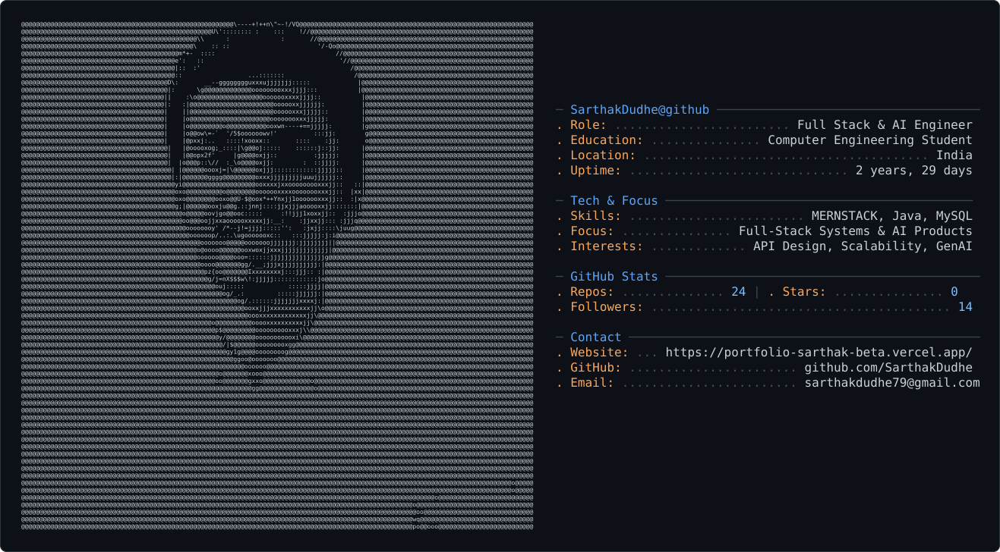

  

    

  

  

    I build full-stack web applications with practical backend architecture, responsive interfaces,
    and AI-powered product features. My work focuses on clean APIs, reliable user flows,
    and software that solves real problems with a polished experience.
  

  

    
    
    
    
  

 

<h2 align="center">👨‍💻 About Me</h2>

<table width="100%">
  <tr>
    <td width="50%" valign="top">
      <h3>⚡ What I Build</h3>
      
I engineer full-stack web applications with <b>React, Node.js, Express, MongoDB, and modern AI APIs</b>. I specialize in turning product requirements into clean, scalable architectures with responsive user experiences.

      <h3>🎯 Career Focus</h3>
      
Actively open to <b>Software Engineer</b>, <b>Full Stack Developer</b>, and <b>Backend Engineer</b> opportunities where I can build and ship high-impact features.

    </td>
    <td width="50%" valign="top">
      <h3>🛠️ Core Engineering Philosophy</h3>
      
Committed to clean API design, secure JWT/RBAC authentication, robust database schema design, and production-ready code with maintainable boundaries.

      <h3>🌱 Continuous Growth</h3>
      
Currently leveling up in <b>System Design</b>, <b>Docker containerization</b>, <b>AWS cloud fundamentals</b>, and scalable backend microservices.

    </td>
  </tr>
</table>

 

<h2 align="center">💡 Engineering Focus &amp; Pillars</h2>

<table width="100%">
  <tr>
    <td width="33%" align="center" valign="top">
       
      
      <h3>High-Performance Systems</h3>
      
Designing low-latency REST &amp; WebSocket APIs, optimized database queries, and snappy, responsive frontend state management.

    </td>
    <td width="33%" align="center" valign="top">
       
      
      <h3>AI-Native Products</h3>
      
Integrating LLMs (Groq, Llama-3, OpenAI) directly into user workflows to solve real matching, extraction, and automation problems.

    </td>
    <td width="33%" align="center" valign="top">
       
      
      <h3>Architecture First</h3>
      
Prioritizing modular service boundaries, strict authentication &amp; RBAC, maintainable data structures, and codebases built to scale.

    </td>
  </tr>
</table>

 

<h2 align="center">Technology Stack</h2>

<table width="100%">
  <tr>
    <td width="50%" valign="top" align="center">
      <h3>Backend</h3>
      
      
REST APIs, authentication, file handling, database schema design, and real-time communication.

    </td>
    <td width="50%" valign="top" align="center">
      <h3>Frontend</h3>
      
      
Responsive interfaces, component-driven development, state management, and polished user flows.

    </td>
  </tr>
  <tr>
    <td width="50%" valign="top" align="center">
      <h3>Deployment</h3>
      
      
Version control, deployment workflows, environment configuration, and production-ready builds.

    </td>
    <td width="50%" valign="top" align="center">
      <h3>Tools</h3>
      
      
API testing, UI planning, cloud fundamentals, and developer workflow optimization.

    </td>
  </tr>
</table>

 

<h2 align="center">🚀 Featured Engineering Projects</h2>

<table width="100%">
  <tr>
    <td width="33%" align="center" valign="top">
      <h3>🤖 InsiderJobs</h3>
      
<b>AI Career Platform</b>

      
Resume gap analysis, AI job matching &amp; automated aggregation.

      
      
    </td>
    <td width="33%" align="center" valign="top">
      <h3>⚡ QuickChat</h3>
      
<b>Real-Time Chat Engine</b>

      
WebSocket events, instant room synchronization &amp; JWT auth.

      
      
    </td>
    <td width="33%" align="center" valign="top">
      <h3>🛒 Feasto</h3>
      
<b>Food Delivery Platform</b>

      
Interactive food catalog, Stripe payments &amp; admin order tracking.

      
      
    </td>
  </tr>
</table>

 

  
<h3>&nbsp;🤖 <b>InsiderJobs — AI-Powered Career Platform</b></h3>

   

  

    
  

  <table width="100%">
    <tr>
      <td width="65%" valign="top">
        <h4>🎯 Key Engineering Highlights</h4>
        <ul>
          <li><b>AI Resume Analysis:</b> Integrated Groq &amp; Llama 3 for structured skill-gap analysis and actionable score breakdowns.</li>
          <li><b>Live Job Aggregation:</b> Connected SerpAPI to fetch, filter, and normalize real-time job listings across domains.</li>
          <li><b>Secure Auth &amp; Media Pipeline:</b> Implemented Clerk JWT authentication with Cloudinary CDN for PDF resume storage.</li>
        </ul>
      </td>
      <td width="35%" valign="top" align="center">
        <h4>🛠️ Tech Stack</h4>
        
         
        
         
        
        
          
        
        
      </td>
    </tr>
  </table>

 

  
<h3>&nbsp;⚡ <b>QuickChat — Real-Time WebSocket Messaging</b></h3>

   

  

    
  

  <table width="100%">
    <tr>
      <td width="65%" valign="top">
        <h4>🎯 Key Engineering Highlights</h4>
        <ul>
          <li><b>Low-Latency Event Pipeline:</b> Built bidirectional messaging over WebSocket using Socket.IO on Node.js.</li>
          <li><b>Optimistic State Synchronization:</b> Managed client message buffers for instant dispatch with zero perceived lag.</li>
          <li><b>JWT Guarded Channels:</b> Secured WebSocket handshakes and REST route access with token-based authentication.</li>
        </ul>
      </td>
      <td width="35%" valign="top" align="center">
        <h4>🛠️ Tech Stack</h4>
        
         
        
         
        
        
          
        
        
      </td>
    </tr>
  </table>

 

  
<h3>&nbsp;🛒 <b>Feasto — Full-Stack Food Ordering Platform</b></h3>

   

  

    
  

  <table width="100%">
    <tr>
      <td width="65%" valign="top">
        <h4>🎯 Key Engineering Highlights</h4>
        <ul>
          <li><b>Stripe Checkout Integration:</b> Built secure payment intent workflows with server-side webhook validation.</li>
          <li><b>Dynamic Cart Engine:</b> Real-time price calculation, stock verification, and persistent user checkout states.</li>
          <li><b>Order Operations Dashboard:</b> Created role-based admin views to manage live order status lifecycle.</li>
        </ul>
      </td>
      <td width="35%" valign="top" align="center">
        <h4>🛠️ Tech Stack</h4>
        
         
        
         
        
        
          
        
        
      </td>
    </tr>
  </table>

 

<h2 align="center">Professional Experience</h2>

<table width="100%">
  <tr>
    <td align="center" valign="top">
      <h3>Software Engineer Intern - Sapphire Infocom Pvt. Ltd.</h3>
      
<b>Aug 14, 2025 - Nov 13, 2025</b>

      

        Worked on production-oriented web development, including scalable APIs,
        React frontend improvements, and debugging performance bottlenecks.
        This experience strengthened how I think about maintainable code,
        deployment readiness, and user-facing reliability.
      

      

        Key focus areas: API development, frontend optimization, production debugging,
        and collaboration across real application workflows.
      

    </td>
  </tr>
</table>

 

<h2 align="center">GitHub Activity</h2>

  

 

  <picture>
    <source media="(prefers-color-scheme: dark)" srcset="https://raw.githubusercontent.com/SarthakDudhe/SarthakDudhe/output/github-contribution-grid-snake-dark.svg">
    <source media="(prefers-color-scheme: light)" srcset="https://raw.githubusercontent.com/SarthakDudhe/SarthakDudhe/output/github-contribution-grid-snake.svg">
    
  </picture>

 

  
  
    
  

 

<h2 align="center">Currently Exploring</h2>

  
  
  
  

 

  <h2>Open to Opportunities</h2>
  

    I am currently exploring Software Engineer, Full Stack Developer,
    and Backend Engineer roles.
  

  
  
  
    
  <i>Clean architecture. Practical AI. Product-focused engineering.</i>

